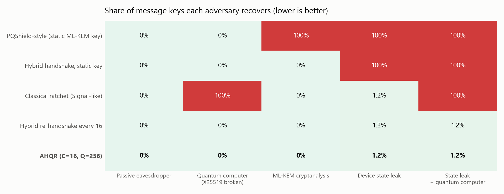
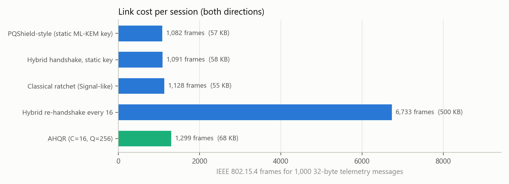
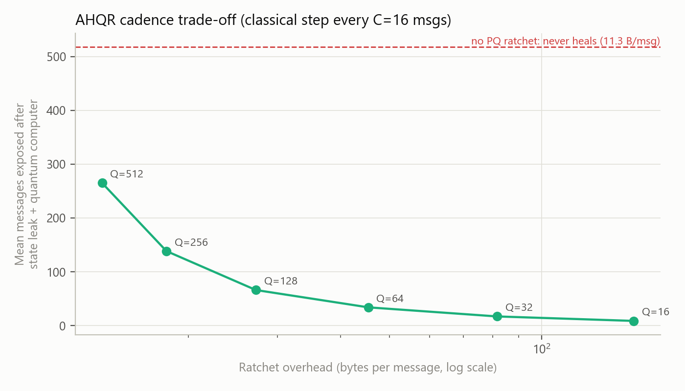
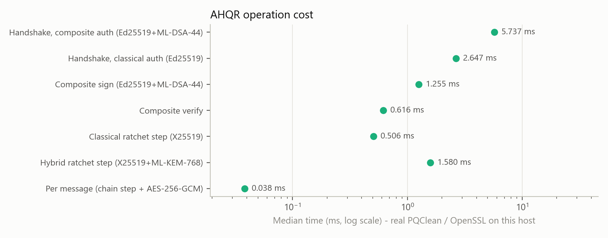

# AHQR — Adaptive Hybrid Quantum-Resilient Ratchet

The project's novel contribution: a key-management protocol for 802.15.4-class IoT devices that combines classical and post-quantum cryptography at three layers, each running at its own cadence.

Code: [`code/ahqr.py`](code/ahqr.py) · Tests: [`code/test_ahqr.py`](code/test_ahqr.py) · Evaluation: [`code/ahqr_evaluation.py`](code/ahqr_evaluation.py)

---

## 1. Problem

The base paper (PQShield-IoT) uses pure PQC: Kyber512 for key exchange, Dilithium2 for signatures. Every session key comes from an encapsulation against the device's static, long-term Kyber key; there is no ephemeral KEM key anywhere in the protocol. Its optimisation layer rotates keys based on energy and throughput. Phases 1–5 of this project measured what that design costs and what it leaves open:

| Observation (measured) | Consequence |
|---|---|
| PQC is cheap in CPU time but expensive on the wire: an ML-KEM-768 public key is 1184 B, or 15 IEEE 802.15.4 frames | Re-keying with PQC often is not affordable on a constrained radio |
| A hybrid X25519 + ML-KEM exchange adds only 64 B over pure ML-KEM | Running classical and PQ together costs almost nothing extra |
| Static KEM keys give no forward secrecy (Gap 6), and rotating keys does not help: each rotation encapsulates to the same long-term key | One leak of the device's KEM key exposes every past and future session |

Existing remedies each fix one part. Re-running a full ephemeral hybrid handshake every 16 messages restores recovery, but costs 8.7× the bytes of the static-key design. A Signal-style classical ratchet recovers cheaply, but a quantum adversary breaks every X25519 step.

## 2. Design

```mermaid
sequenceDiagram
    participant D as IoT device
    participant G as Gateway
    Note over D,G: Layer 1: authenticated hybrid handshake (once)
    G->>D: X25519 pub, ML-KEM pub, Sig_G(offer)
    D->>G: X25519 pub, ML-KEM ct, Sig_D(full transcript)
    Note over D,G: rk = HKDF(ss_x || ss_pq, transcript); Sig = Ed25519 AND ML-DSA-44
    loop every message
        D->>G: AES-256-GCM(mk_i, reading); (ck, mk_i) = KDF(ck)
    end
    Note over D,G: Layer 2a: every C messages, classical step (+84 B)
    G->>D: fresh X25519 pub
    D->>G: fresh X25519 pub, rk = HKDF(rk, ss_x)
    Note over D,G: Layer 2b: every Q messages, hybrid step (+2.3 KB)
    G->>D: fresh X25519 pub, fresh ML-KEM pub
    D->>G: X25519 pub, ML-KEM ct, rk = HKDF(rk, ss_x || ss_pq)
```

### Layer 1: authenticated hybrid handshake
* Key exchange: ephemeral X25519 plus ephemeral ML-KEM-512 or ML-KEM-768.
* Root key: `rk = HKDF-SHA3-256(salt=0, ikm = ss_x25519 || ss_mlkem, info = "AHQR-root" || transcript)`. The transcript binds both ciphertexts, which makes the concatenation combiner robust (Giacon–Heuer–Poettering 2018).
* Authentication uses a composite signature, Ed25519 AND ML-DSA-44, which verifies only if both halves verify. A forger has to break both schemes; the base paper relies on Dilithium2 alone.
* Two flights. The gateway signs its ephemeral offer (like a signed pre-key); the device signs the full transcript, which binds both offers and its reply. The first data message gives implicit key confirmation.

### Layer 2: dual-cadence hybrid ratchet

| Cadence | Operation | Extra bytes | Property gained |
|---|---|---|---|
| every message | `(ck, mk) = HKDF(ck)`, a one-way chain | 0 | Per-message forward secrecy |
| every **C** messages | X25519 ratchet: `rk = HKDF(salt=rk, ikm=ss_x)` | 84 (64 B keys + 20 B envelope) | Post-compromise healing against classical attackers |
| every **Q** messages | Hybrid ratchet: `rk = HKDF(salt=rk, ikm=ss_x‖ss_pq)` | 2.3 KB (ML-KEM-768) | Post-compromise healing that also holds against a quantum attacker |

The old root is the HKDF salt and the fresh secrets are the IKM. If HMAC is modelled as a dual-PRF (the assumption behind TLS 1.3's key schedule), a new root is pseudorandom when **either** the old root **or** any fresh secret is unknown to the attacker.

### Layer 3: Mosca-adaptive policy
Mosca's inequality: data is at risk if **x + y > z**, where x is the data's shelf-life, y the migration time and z the years until a cryptographically relevant quantum computer (CRQC) exists. `policy()` uses it as follows:

* **Confidentiality** has to be PQ now whenever x + y > z, because of harvest-now-decrypt-later. This sets Q to daily rather than weekly.
* **Authentication** only has to hold at the moment of the handshake, since a recorded handshake cannot be forged after the fact. Until y ≥ z, the two 2.4 KB ML-DSA signatures are optional; dropping them cuts a mutually authenticated handshake from 91 to 31 frames.
* **Device class** (RFC 7228) sets the KEM level. Class 0 nodes delegate PQ to the gateway.

The base paper's optimisation layer also adapts per device (algorithm pruning, key rotation driven by energy and throughput). The difference is the input: AHQR's policy is driven by a threat model, and it treats confidentiality and authentication separately. The cadence values themselves (C about hourly; Q daily or weekly) are heuristics.

## 3. Evaluation

The evaluation sends 1,000 messages of 32 B each, using real PQClean and OpenSSL primitives. Each adversary is simulated by re-deriving keys with the protocol's own KDFs, and every key it derives is checked against the real one. The adversary records all traffic and stays passive after a leak (see Limitations). State-leak results are the mean over 27 leak points spread across the session, because a single leak point can land just before a ratchet step and flatter one design.

Two AHQR settings are compared. Q = 16 recovers as fast as re-handshaking every 16 messages. Q = 256 accepts a longer recovery window against a quantum attacker in exchange for much less traffic.

### Security


* The static-key designs, including the base paper's, lose every message to a single state leak.
* The classical ratchet recovers from a leak within 16 messages, but if the attacker also has a quantum computer it never recovers.
* AHQR with Q = 16 matches periodic hybrid re-handshaking in every column. With Q = 256 it still recovers against a quantum attacker, but only after about Q/2 = 128 messages on average (13.8 % of the session).

### Link cost


| Design | Bytes | 802.15.4 frames | Recovery after a leak, quantum attacker |
|---|---:|---:|---|
| PQShield-style static key | 58,536 | 1,082 | never |
| Hybrid re-handshake every 16 | 512,152 | 6,733 | within 16 messages |
| AHQR (C=16, Q=16) | 205,376 | 2,951 | within 16 messages |
| AHQR (C=16, Q=256) | 71,328 | 1,299 | within 256 messages |

* At equal recovery speed (Q = 16), AHQR sends 2.5× fewer bytes and 2.3× fewer frames than re-handshaking. The saving comes from not re-sending two 2.4 KB ML-DSA signatures at every step; each ratchet step is chained to the authenticated root key instead.
* At Q = 256, AHQR needs 20 % more frames than the base paper's design. In exchange it gains forward secrecy, hybrid protection and recovery after a compromise.

### Trade-off


After a leak plus a quantum attacker, the mean exposure stays close to Q/2: 8.7 messages at Q = 16 and 138 at Q = 256. The overhead per message falls roughly as 1/Q, from 153 B at Q = 16 to 19 B at Q = 256. Q is the operator's setting for trading bandwidth against recovery time.

### Compute cost


On the laptop CPU, a hybrid ratchet step takes about 1.6 ms, a message about 0.04 ms, and a handshake about 6 ms with composite authentication (2.6 ms with Ed25519 alone). As the earlier phases found, bandwidth is the binding cost, not CPU time.

## 4. Verified properties (`python code/test_ahqr.py`)

12 tests pass, including:
* the composite signature is rejected if either half is forged or stripped;
* a CRQC that breaks every X25519 recovers 0 keys, and an ML-KEM break alone recovers 0 keys;
* after a state leak at message t, no key before t is exposed (forward secrecy) and none after the next ratchet step;
* a state leak plus a CRQC is healed by the next hybrid step, and never healed by the classical ratchet;
* the Mosca policy tightens Q when x + y > z.

## 5. Relation to prior work

Each building block already exists separately: hybrid KEMs (TLS 1.3 `X25519MLKEM768`, X-Wing), composite signatures (IETF LAMPS drafts), and PQ ratchets (Signal PQXDH and the SPQR triple ratchet). The contribution here is their co-design for constrained IoT:

1. a two-cadence ratchet whose PQ interval is an explicit bandwidth/healing parameter, with the trade-off measured;
2. an executable adversary simulator that computes, rather than asserts, which keys each attacker recovers;
3. a Mosca-driven policy that separates the PQ requirement for confidentiality from the one for authentication, and sets the cadences per RFC 7228 device class.

AHQR implements one item from the future-work list in [EXPLANATION.md](EXPLANATION.md), the authenticated hybrid handshake, and part of another: the policy selects parameters per RFC 7228 class, but it does not yet read the measured device-class matrix.

## 6. Limitations

* Recovery after a leak assumes the attacker is passive at the next ratchet step. An attacker who holds the leaked state and is active at that moment can answer the step with its own keys and stay in. Signal's double ratchet has the same limitation. Re-handshaking with signatures avoids it only if the long-term signing keys did not leak as well.
* The endpoints are simulated in-process. The bytes are real, but no radio is involved.
* Frame counts ignore 6LoWPAN/UDP headers, so they are a lower bound. Ratchet replies are assumed to ride on the next data message.
* There is no formal (computer-checked) proof, and no replay or reordering window for lost messages.
* Timings come from an x86 laptop. There are no Cortex-M figures for AHQR yet.
