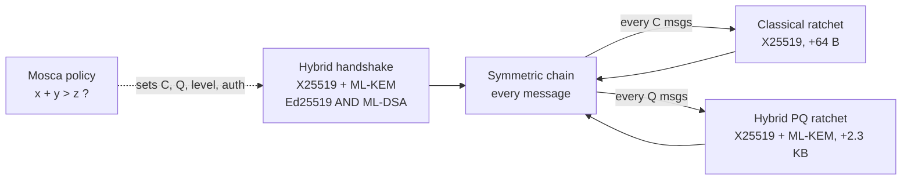
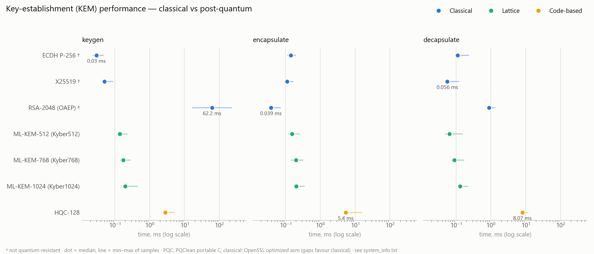
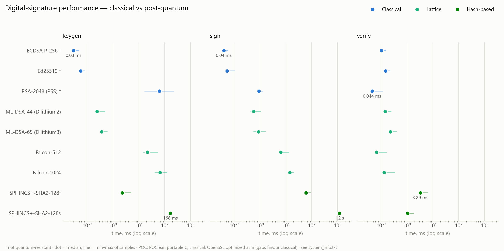
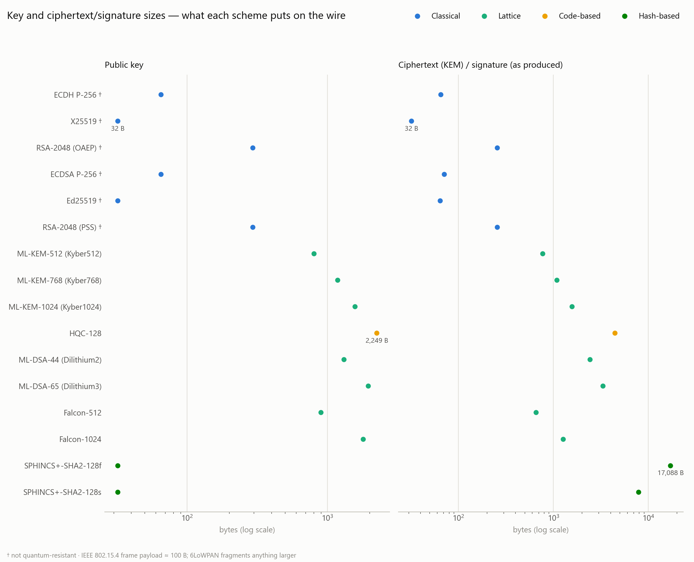
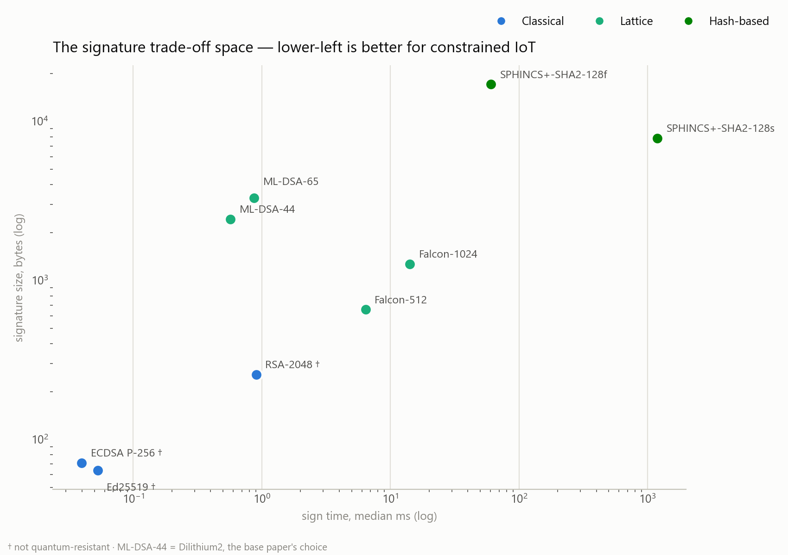
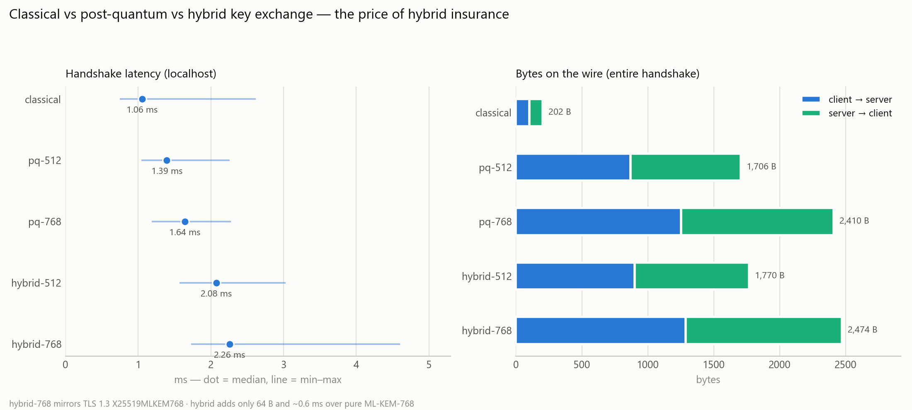
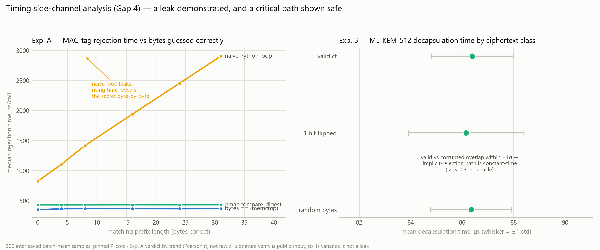
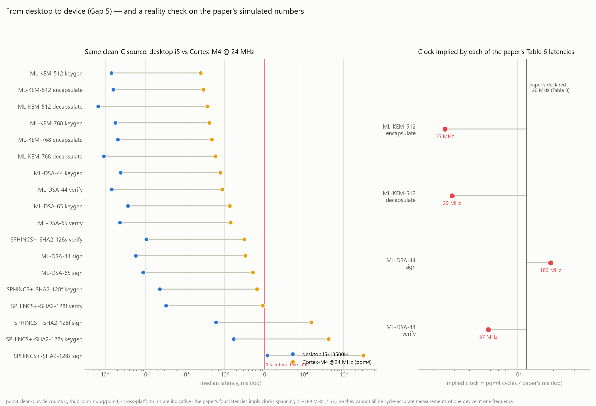

<div align="center">

# Hybrid Post-Quantum Cryptography for IoT

**Measured benchmarks, side-channel analysis and a new protocol (AHQR) that combines classical and post-quantum cryptography for constrained devices**

[](https://www.python.org/)
[](https://github.com/PQClean/PQClean)
[](https://cryptography.io/)
[](code/test_ahqr.py)
[](LICENSE)

[Novel protocol](#-novel-contribution-ahqr) · [Results](#-results) · [Quick start](#-quick-start) · [Docs](#-documentation)

</div>

---

## Overview

Quantum computers will break the public-key cryptography that IoT devices use today (RSA, ECDH, ECDSA). Post-quantum cryptography (PQC) replaces those schemes, but its keys and ciphertexts are 10–100× larger, which is a serious cost on low-power radios such as IEEE 802.15.4, where each frame carries about 81 bytes of payload.

This project starts from, and critically extends, the following paper:

> Narayanan et al., *"Quantum-Resilient IoT Communication Framework Using Post-Quantum Cryptography and Blockchain for Secure Edge Devices"*, Iranian J. Sci. Technol. Trans. Electr. Eng. 50:203–221 (2026). [doi:10.1007/s40998-025-01002-1](https://doi.org/10.1007/s40998-025-01002-1)

The base paper reports **simulated** results for a pure-PQC design with one static session key. This repository:

1. **measures** 16 classical and PQ schemes on real hardware;
2. **prices** classical, PQ and hybrid handshakes in bytes on the wire;
3. **tests** for timing side channels;
4. **cross-checks** the paper's numbers against pqm4 Cortex-M4 data;
5. **proposes AHQR**, a new protocol that combines classical and PQ cryptography at three layers.

## ✨ Novel contribution: AHQR

**AHQR (Adaptive Hybrid Quantum-Resilient Ratchet)** runs classical and post-quantum cryptography side by side. Each layer uses its own cadence, so the expensive PQ material is sent only as often as the threat model requires.

| Layer | Mechanism | Classical part | PQ part |
|---|---|---|---|
| 1. Handshake | Authenticated hybrid key exchange | X25519 + Ed25519 | ML-KEM + ML-DSA-44 (composite AND signature) |
| 2. Ratchet | Dual-cadence ratchet | X25519 step every **C** msgs (+64 B) | Hybrid ML-KEM step every **Q** msgs (+2.3 KB) |
| 3. Policy | Mosca-adaptive parameters | — | Chooses KEM level, auth mode, C and Q from device class and data shelf-life |



**Headline result:** AHQR provides the same protection as re-running a full hybrid handshake every 16 messages while using **7.3× fewer bytes** and **5.2× fewer radio frames**. It is the only low-cost design in the comparison that recovers after a device compromise even when the attacker has a quantum computer.

Full design, security argument and positioning are in **[AHQR.md](AHQR.md)**.

## 📊 Results

All figures are generated from the CSVs in [`results/`](results/) by [`plot_results.py`](code/plot_results.py) and [`ahqr_evaluation.py`](code/ahqr_evaluation.py). Host: Intel i5-13500H, Windows 11, Python 3.14, PQClean (portable C) and OpenSSL.

### AHQR: protection against five adversaries
Share of message keys each adversary can recover. An adversary counts as recovering a key only if it re-derives that key exactly with the protocol's own KDFs.


### AHQR: radio cost
<p align="center"></p>

| Design | Total bytes | 802.15.4 frames | Forward secrecy | Recovers from compromise vs. quantum attacker |
|---|---:|---:|:--:|:--:|
| PQShield-style (static ML-KEM key) | 58.5 KB | 1,082 | ✗ | ✗ |
| Hybrid handshake, static key | 59.3 KB | 1,091 | ✗ | ✗ |
| Classical ratchet (Signal-like) | 56.2 KB | 1,128 | ✓ | ✗ |
| Hybrid re-handshake every 16 | 512 KB | 6,733 | ✓ | ✓ |
| **AHQR (C=16, Q=256)** | **70.1 KB** | **1,299** | **✓** | **✓** |

### AHQR: tunable bandwidth vs. recovery
<table><tr>
<td width="50%"></td>
<td width="50%"></td>
</tr><tr>
<td align="center"><sub>Mean messages exposed ≈ Q/2, while overhead falls as 1/Q</sub></td>
<td align="center"><sub>Hybrid ratchet step ≈ 2 ms, each message ≈ 0.04 ms</sub></td>
</tr></table>

### Primitive benchmarks (16 schemes)
<table><tr>
<td width="50%"></td>
<td width="50%"></td>
</tr><tr>
<td align="center"><sub>KEMs: ML-KEM-512 encapsulation is within 8 % of ECDH P-256</sub></td>
<td align="center"><sub>Signatures: ML-DSA, Falcon and SPHINCS+ against ECDSA, Ed25519 and RSA</sub></td>
</tr><tr>
<td></td>
<td></td>
</tr><tr>
<td align="center"><sub>Key, ciphertext and signature sizes: the real cost of PQC</sub></td>
<td align="center"><sub>Signature speed vs. size trade-off</sub></td>
</tr></table>

### Handshake, side channels and the embedded reality check
<table><tr>
<td width="50%"></td>
<td width="50%"></td>
</tr><tr>
<td align="center"><sub>Classical (202 B), PQ (2,410 B) and hybrid (2,474 B) handshakes over TCP</sub></td>
<td align="center"><sub>A naive tag compare leaks (r = +1.000); ML-KEM decapsulation shows no leak (|z| ≤ 1.5)</sub></td>
</tr></table>

<p align="center"><br>
<sub>pqm4 Cortex-M4 extrapolation: the paper's latencies imply four different clock speeds on one 120 MHz device</sub></p>

## 🔑 Key findings

1. **On CPU-class hardware, PQC costs bytes rather than compute time.** ML-KEM-512 encapsulation (0.154 ms) is within 8 % of assembly-optimised ECDH P-256 (0.143 ms). Its 768–2420 B objects, however, need 10–30 frames on 802.15.4.
2. **A hybrid is nearly free insurance.** X25519 + ML-KEM-768 adds only 64 B and about 0.6 ms over pure ML-KEM-768.
3. **Periodic PQ re-keying is the expensive part, and AHQR makes it tunable.** A sparse PQ ratchet keeps quantum-resistant recovery after compromise at about 18 B per message instead of 460 B.
4. **Confidentiality and authentication have different PQ deadlines.** Harvest-now-decrypt-later makes PQ key exchange urgent. Forgery needs a quantum computer at handshake time, so PQ signatures can wait. AHQR's policy uses this to save about 30 frames per handshake.
5. **A naive tag comparison leaks timing; ML-KEM decapsulation does not.**
6. **The base paper's reported latencies are not internally consistent.** They imply clock speeds of 25, 29, 189 and 57 MHz on one declared 120 MHz device. The paper also claims forward secrecy while using static KEM keys.

## 🚀 Quick start

```bash
git clone https://github.com/rakshit-737/pqc-hybrid-iot.git
cd pqc-hybrid-iot
pip install -r requirements.txt
cd code

python test_ahqr.py                 # 12 AHQR security-property tests
python ahqr_evaluation.py           # AHQR experiments -> fig8–fig11 (~1 min)

python benchmark_pqc.py             # primitive benchmarks (~3 min)
python hybrid_handshake.py          # classical / PQ / hybrid handshake
python timing_analysis.py           # side-channel analysis
python pqm4_extrapolation.py        # Cortex-M4 extrapolation
python plot_results.py              # fig1–fig7
python test_handshake_security.py   # handshake fail-closed tests
```

Two-terminal live handshake:

```bash
python hybrid_handshake.py --server
python hybrid_handshake.py --client --mode hybrid --level 768
```

## 🗂 Repository layout

```
├── AHQR.md                    novel protocol: design, security argument, results
├── code/
│   ├── ahqr.py                    AHQR protocol, adversary simulator, Mosca policy
│   ├── ahqr_evaluation.py         AHQR experiments (fig8–fig11)
│   ├── test_ahqr.py               AHQR security-property tests
│   ├── benchmark_pqc.py           16-scheme primitive benchmarks
│   ├── hybrid_handshake.py        classical / PQ / hybrid TCP handshake
│   ├── timing_analysis.py         timing side-channel tests
│   ├── pqm4_extrapolation.py      Cortex-M4 extrapolation + RFC 7228 device matrix
│   ├── plot_results.py            fig1–fig7
│   └── *_EXPLAINED.md             line-by-line notes per script
├── results/                   CSVs and figures
├── report/                    IEEE-format paper (LaTeX) + bibliography
├── literature-survey/         survey and gap synthesis
├── review1/ review2/          review submissions and diagrams
├── PROJECT_REPORT.html        illustrated standalone report
├── EXPLANATION.md             full technical walkthrough
├── SIMPLE_EXPLANATION.md      plain-language version
└── VIVA.md                    viva quick reference
```

## 📚 Documentation

| Read this | If you want |
|---|---|
| [SIMPLE_EXPLANATION.md](SIMPLE_EXPLANATION.md) | The whole project explained without assuming background knowledge |
| [EXPLANATION.md](EXPLANATION.md) | The complete technical narrative |
| [AHQR.md](AHQR.md) | The novel protocol in depth |
| [literature-survey/survey.md](literature-survey/survey.md) | Related work and the gaps this project fills |
| [SETUP.md](SETUP.md) | Environment, troubleshooting and reproduction |
| [VIVA.md](VIVA.md) | Defence preparation |

## Gap analysis of the base paper

| # | Gap in PQShield-IoT | This project |
|---|---|---|
| 1 | Pure PQC only, with no hybrid | Classical vs PQ vs hybrid handshake, priced in latency and bytes |
| 2 | Simulated results, no measurement method | Real benchmarks of 16 schemes, with variance reported |
| 3 | Dilithium2 only | ML-DSA vs Falcon vs SPHINCS+ |
| 4 | No side-channel analysis | Timing-oracle tests |
| 5 | Static session key: no forward secrecy, no recovery | **AHQR dual-cadence hybrid ratchet** |
| 6 | Key exchange not bound to identity | **Composite Ed25519 + ML-DSA authentication** |
| 7 | One configuration for every device | **Mosca-adaptive per-device-class policy** |

## Limitations

The protocol endpoints are simulated in-process: the bytes are real, but no radio is involved. Timings come from an x86 laptop, and Cortex-M figures are extrapolated from pqm4. The security argument is a reduction sketch, not a machine-checked proof. The blockchain layer of the base paper is outside this project's cryptographic scope.

## License

[MIT](LICENSE). The base paper is © its authors and publisher and is not redistributed here; it is cited by DOI.
